*This project has been created as part of the 42 curriculum by dbakker, egrisel, mgroos, mvan-rij.*

# Gotta Bike Fast!

## Description

This project is a web application for a (multiplayer) typing speed game.
Hit keys on your keyboard to type words faster than the competition, develop your typing skills and climb the leaderboard.

### Features

- Simple single player: On the home page, you will automatically be in your own room and you can just click start game. When the prompt shows up, type all the words correctly as fast as possible. You will then be shown your score at the end. (egrisel, mgroos, mvan-rij)
- Multiplayer rooms with spectators: Players can invite others by sharing a unique 6-digit room ID. Invited users can join the room either as a player or as a spectator by entering the room ID and selecting the appropriate option before connecting. You can then start the game and play against the other users. You will then be shown the scores and rankings of the users. (egrisel, mgroos, mvan-rij)
- User login for result logging: You can click the login/make an account button in the top right. This will take you to a page where you can login as an existing user or register as a new user. Now when you play a game while logged in, your game history and stats will be saved and users can see you username in the game room. (egrisel, mgroos, mvan-rij)
- User page to view results and progress: When logged in you can click the profile button and see your stats such as words per minute typed and your match history. (dbakker, egrisel, mgroos, mvan-rij)
- Public leaderboard: You can click the leaderboard button where it will show you a ranking of all account-having players based on stats such as words per minute and accuracy. (dbakker, mgroos)
- API for getting user results: With the API generated from the profile page after logging in, users can programmatically interact with our service, make profile changes and view profile details. (dbakker, egrisel)

## Instructions

### Requirements
- [Docker](https://www.docker.com/) For containerization.
- [OpenSSL](https://openssl-library.org/) To create secure certs for https.
- [npm](https://www.npmjs.com/) As package manager for development and to run setup/start scripts.

### Installation steps
1. `git clone <project_url> [local_folder_name]`
2. `cd [local_folder_name]`
3. Create a .env (an .env.example is provided with all necessary information).
3. `npm run prod`

### Certs
If no HTTPS certs (localhost.crt and localhost.key) are provided in ./.certs the project will create some self-signed localhost certs.

## Technical Stack
[//]: <> (Todo add better justification.)

| Architecture | Tech Stack | Justification |
| :----------- | :--------- | :------------ |
| Frontend      | React + TypeScript is used as the primary framework. For our styling solution we are using Tailwind CSS. To serve the static compiled pages we are using NGINX as the webserver. We are using Socket.io for the client side handling of the WebSockets. Npm is used as package manager for development and to run setup/start scripts. | ReactJS is industry standard. Reusable components are a useful feature of ReactJS for our project as we have reused many component like buttons and text fields. Tailwind makes styling much easier than plain CSS. Typescript helps prevent runtime errors by performing type checking at compile time. Socket.io was used because this is a real time game so using sockets is more efficient than sending many separate HTTP requests to the backend. Npm is the most used package manager for JS and has millions of packages. |
| Backend       | ExpressJS + TypeScript is used as the primary framework. We are using Prisma ORM as our bridge to the database. To document our API we use OpenAPI for the specification and Swagger to create our documentation pages. We are using Socket.io for the server side handling of the WebSockets. Npm is used as package manager for development and to run setup/start scripts. Socket.io was used for game logic communication between client and server.| ExpressJS is widely used in the industry. It is a simple framework so it is a good first framework to learn. It is a JavaScript/TypeScript framework so the frontend and backend can be in the same language, meaning we only had to learn one new language. Typescript helps prevent run time errors by performing type checking at compile time. Prisma ORM makes interacting with the database easier as we don't have to write raw SQL queries and it has builtin SQL injection protection. Socket.io was used because this is a real time game so using sockets is more efficient than sending many separate HTTP requests to the backend. Npm is the most used package manager for JS and has millions of packages. |
| Database      | A default postgress installation is used as the database. | Industry standard database that integrates seamlessly with prisma ORM.  |
| Webserver | NGINX is used as the primary webserver to route traffic from outside to each of our containers. | Industry standard and makes implementing HTTPS easy. Also, some teammates already used NGINX in a previous project, so there was less time spent learning how it works. |

### Database Schema

## Subject Modules

| Modules | Points | Implementation | Justification | Contributed |
| :------ | :----- | :------------- | :------------ | :---------- |
| **WEB** Use a framework for both the frontend and backend. | 2 | We are using React for the frontend and ExpressJS for the backend. | ReactJS is industry standard. Reusable components are a useful feature of ReactJS for our project as we have reused many component like buttons and text fields. ExpressJS is widely used in the industry. It is a simple framework so it is a good first framework to learn. It is a JavaScript/TypeScript framework so the frontend and backend can be in the same language, meaning we only had to learn one new language. | All team members have contributed/worked with both frameworks. |
| **WEB** Implement real-time features using WebSockets or similar technology. | 2 | The game logic communicates via WebSockets to receive and send updates to clients and the server. | Socket.io was used because this is a real time game so using sockets is more efficient than sending many separate HTTP requests to the backend | egrisel and mvan-rij have implemented and worked with the backend logic for the sockets. mgroos and mvan-rij have implemented and worked with the sockets for the frontend. |
| **WEB** use ORM for the database. | 1 | Prisma is used for an ORM compatible database. | Prisma ORM makes interacting with the database easier as we don't have to write raw SQL queries and it has builtin SQL injection protection. | All team members have contributed/worked with the ORM database. |
| **WEB** A public API to interact with the database with a secured API key, rate limiting, documentation, and at least 5 endpoints. | 2 | The api has secure hashed API tokens, rate limiting middleware, industry standard Swagger documentation and enough endpoints. | We wanted to learn how APIs work and how to build them. Also we want to provide a way for users to interact with our service programmatically. | dbakker and egrisel have implemented API endpoints. egrisel has implemented the API key, rate limiting and documentation. |
| **Accessibility and Internationalization**  Support for additional browsers. | 1 | During development only browser features that are industry standard and widely supported were used. | We want users to be able to use different browsers. | All team members have worked on keeping the code flexible across browsers. |
| **User Management** Game statistics and match history. | 1 | We track the users wins, total games, wpm (words per minute), cpm (characters per minute) and accuracy (correctly typed characters out of all typed characters). These are displayed on their profile. This is also where a user can access their match history and wpm/accuracy progression over time. | We want users to be able to see their performance and progression so they know what they need to improve on. | All team members have contributed/worked with the user game statistics and history. |
| **Gaming and user experience** Implement a complete web-based game where users can play against each other. | 2 | We made a realtime multiplayer typing speed game. You win by typing the prompt the fastest, and can't continue until you fix your own errors. | We like online games like typeracer and monkeytype and thought it would be fun to play and technically challenging to implement. | egrisel, mgroos and mvan-rij contributed/worked on the implementation of the game. |
| **Gaming and user experience** Remote players — Enable two players on separate computers to play the same game in real-time. | 2 | Multiple players from within the same network can play together. With proper setup like DNS and port-forwarding, remote players from different networks are also possible. | Due to how the game works, we need multiple computers for multiplayer to work properly. | egrisel and mvan-rij have worked on the project configuration to make this possible. egrisel, mgroos and mvan-rij have implemented code logic for this module to work. |
| **Gaming and user experience** Multiplayer game (more than two players). | 2 | The game supports up to a server side configurable amount of players (default 100) per lobby that are all playing against each other. | We want to be able to play with many friends at the same time to see who can type the fastest. | egrisel and mvan-rij have worked on the project configuration to make this possible. egrisel, mgroos and mvan-rij have implemented code logic for this module to work. |
| **Gaming and user experience** Implement spectator mode for games. | 1 | You can join a room as spectator at any time and get updates about the players in that room. | We want users to be able to watch their friends play if they are not in the mood to play the game themselves. | egrisel and mvan-rij have implemented the code logic for this module to work. |
| | **Total points: 16** | | |

## The Team

| Member    | Roles                     |
| :-------- | :------------------------ |
| dbakker   | Developer                 |
| egrisel   | Developer, Technical Lead |
| mgroos    | Developer, PM             |
| mvan-rij  | Developer, PO             |

| Role                 | Brief description of their responsibilities |
| :------------------- | :------------------------------------------ |
| Developer            | Write code for assigned features. Participate in code reviews. Test their implementations. Document their work. |
| Technical Lead       | Defines technical architecture. Makes technology stack decisions. Ensures code quality and best practices. |
| PM (Product Manager) | Organizes team meetings and planning sessions. Tracks progress and deadlines.  Ensures team communication. |
| PO (Product Owner)   | Maintains the product backlog. Makes decisions on features and priorities. Validates completed work. |

### Project Management

The team organized the work by dividing the work into smaller tasks. These were then distributed to the team by preference per team member. These tasks were managed using GitHub Issues to keep track of progress and responsibility. For communications, we relied on a mix of in-person (impromptu) meetings and Slack. A small progress meeting (stand-up) was held almost daily. In these meetings, the progress and any roadblocks were discussed.

### Individual Contributions
#### dbakker
This team member has contributed/worked with the following modules:
- **WEB** Use a framework for both the frontend and backend.
- **WEB** use ORM for the database.
- **WEB** A public API to interact with the database with a secured API key, rate limiting, documentation, and at least 5 endpoints.
- **Accessibility and Internationalization**  Support for additional browsers.
- **User Management** Game statistics and match history.

and the following features:
- User page to view results and progress.
- Public leaderboard.
- User API for getting user results and information.
- Admin API for getting users, deleting users and API keys.

Personal challenges faced and overcome:
- The challenge to learn TypeScript was overcome with the power of the internet.

#### egrisel
This team member has contributed/worked with the following modules:
- **WEB** Use a framework for both the frontend and backend.
- **WEB** Implement real-time features using WebSockets or similar technology.
- **WEB** use ORM for the database.
- **WEB** A public API to interact with the database with a secured API key, rate limiting, documentation, and at least 5 endpoints.
- **Accessibility and Internationalization**  Support for additional browsers.
- **User Management** Game statistics and match history.
- **Gaming and user experience** Implement a complete web-based game where users can play against each other.
- **Gaming and user experience** Remote players — Enable two players on separate computers to play the same game in real-time.
- **Gaming and user experience** Multiplayer game (more than two players).
- **Gaming and user experience** Implement spectator mode for games.

and the following features:
- Simple single player.
- Multiplayer rooms.
- User login for result logging.
- User page to view results and progress.
- API for getting user results.

Personal challenges faced and overcome:
- Getting things to be where they should be on the frontend with TailwindCSS was solved by asking my peers how they would do it.
- Struggling with how to structure the expressjs backend was solved by finding a guide online that we followed.

#### mgroos
This team member has contributed/worked with the following modules:
- **WEB** Use a framework for both the frontend and backend.
- **WEB** Implement real-time features using WebSockets or similar technology.
- **WEB** use ORM for the database.
- **Accessibility and Internationalization**  Support for additional browsers.
- **User Management** Game statistics and match history.
- **Gaming and user experience** Implement a complete web-based game where users can play against each other.
- **Gaming and user experience** Multiplayer game (more than two players).

and the following features:
- Simple single player.
- Multiplayer rooms.
- User login for result logging.
- User page to view results and progress.
- Public leaderboard.

Personal challenges faced and overcome:
- Documentation was less helpful than usual due to the combination of languages/styling/etc used (example: ReactJS solutions only work once also transposed to TypeScript). I had to rely more on forum posts and help from peers.

#### mvan-rij
This team member has contributed/worked with the following modules:
- **WEB** Use a framework for both the frontend and backend.
- **WEB** Implement real-time features using WebSockets or similar technology.
- **WEB** use ORM for the database.
- **Accessibility and Internationalization**  Support for additional browsers.
- **User Management** Game statistics and match history.
- **Gaming and user experience** Implement a complete web-based game where users can play against each other.
- **Gaming and user experience** Remote players — Enable two players on separate computers to play the same game in real-time.
- **Gaming and user experience** Multiplayer game (more than two players).
- **Gaming and user experience** Implement spectator mode for games.

and the following features:
- Simple single player.
- Multiplayer rooms.
- User login for result logging.
- User page to view results and progress.

Personal challenges faced and overcome:
- When setting up the tech stack there was a lot of version collision specifically with the combination: Prisma, ExpressJS and Postgres. This was overcome by googling a lot and in the end downgrading Prisma to a more stable version.
- Understanding how npm works and finally figuring out you can run npm install on the host system and don't need to develop in a vscode devcontainer. This was overcome by luck and running npm install on the host by accident.

## Resources

ReactJS:
- [Classnames](https://www.geeksforgeeks.org/reactjs/reactjs-classname-attribute/)
- [Docs](https://react.dev/)
- [useContext](https://dev.to/madv/usecontext-with-typescript-23ln)
- [Context](https://lovetrivedi.medium.com/unlocking-the-full-potential-of-react-context-with-custom-hooks-f3d7e3a3d403)
- [Autentification Context](https://medium.com/@kimtai.developer/react-typescript-authentication-guide-using-context-api-5c82f2530eb1)

Tailwind / CSS:
- [Controlling Tailwind trough ReactJS Github post](https://github.com/tailwindlabs/tailwindcss/discussions/1507)
- [Controlling Tailwind trough ReactJS Reddit post](https://www.reddit.com/r/tailwindcss/comments/14cc9m1/tailwind_styles_not_working_when_passed_as_a/?solution=423c8a6a6c39a0c5423c8a6a6c39a0c5&js_challenge=1&token=7afd7253fec22262ff1c52b1703fe9eccb9064a97031e5cc54bfc1a0ca9f0e4b&jsc_orig_r=)
- [Cursor Shadowbox](https://www.geeksforgeeks.org/css/how-to-add-a-box-shadow-on-one-side-of-an-element-using-css/)
- [Tables](https://www.material-tailwind.com/docs/react/table)

ExpressJS:
- [Youtube Tutorials](https://www.youtube.com/@WebDevSimplified)
- [ExpressJS basics](https://medium.com/@dwincahya8/best-practices-for-structuring-and-writing-express-js-applications-0fa4fe127f07)

API:
 - [OpenAPI](https://swagger.io/specification/)
 - [Swagger](https://swagger.io/docs/)

Backend:
- [Folder Structure](https://oneuptime.com/blog/post/2026-01-26-expressjs-structure-scale/view#application-layer-architecture)
- [Prisma](https://www.prisma.io/docs/prisma-orm/quickstart/postgresql)
- [Prisma visual scematic generation](https://www.npmjs.com/package/prisma-erd-generator)

Tech Stack:
- [Docker](https://docs.docker.com/)
- [npm](https://docs.npmjs.com/)
- [SocketIo](https://socket.io/docs/v4/)
- [vitest](https://vitest.dev/guide/)

### Special mentions

- [TypeRacer](https://play.typeracer.com/)
- [monkeytype](https://monkeytype.com/)
- [Queen](https://www.youtube.com/watch?v=xt0V0_1MS0Q)

### AI Usage
AI was used for ideation, researching, explanation and debugging. In some cases example snippets of code provided by AI were used and adapted to our use case. AI was NOT used to create complete features, only provide examples and feedback.